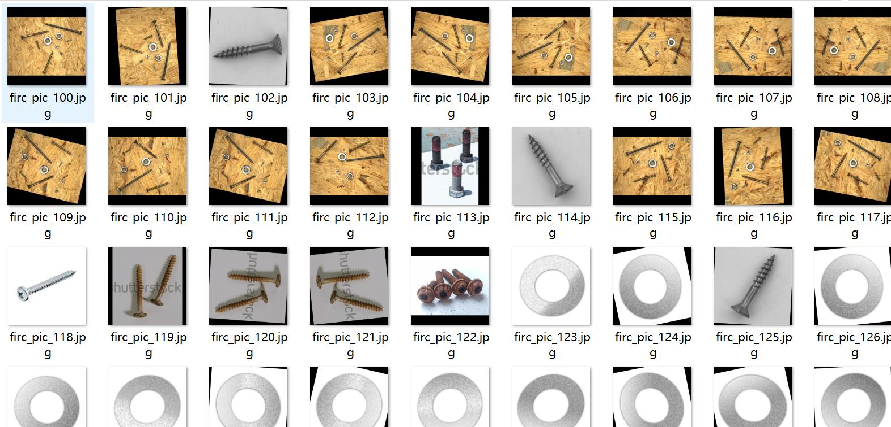
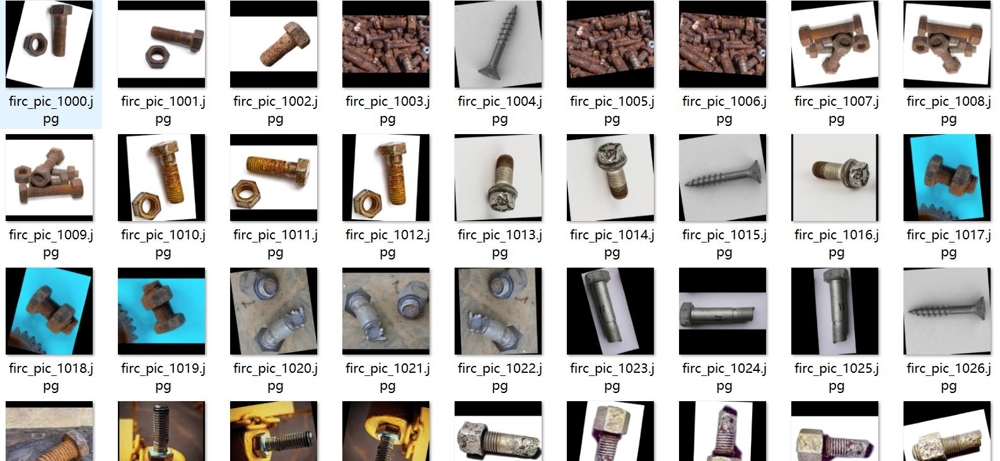
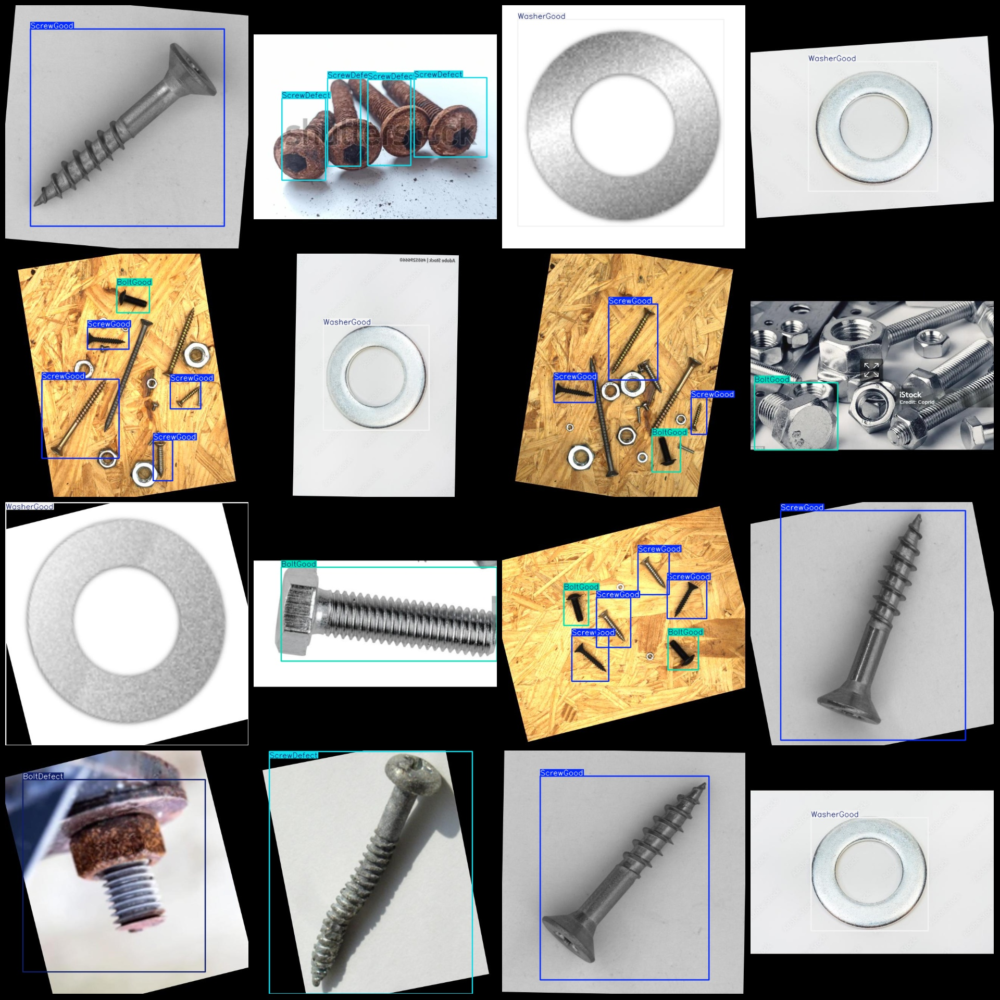
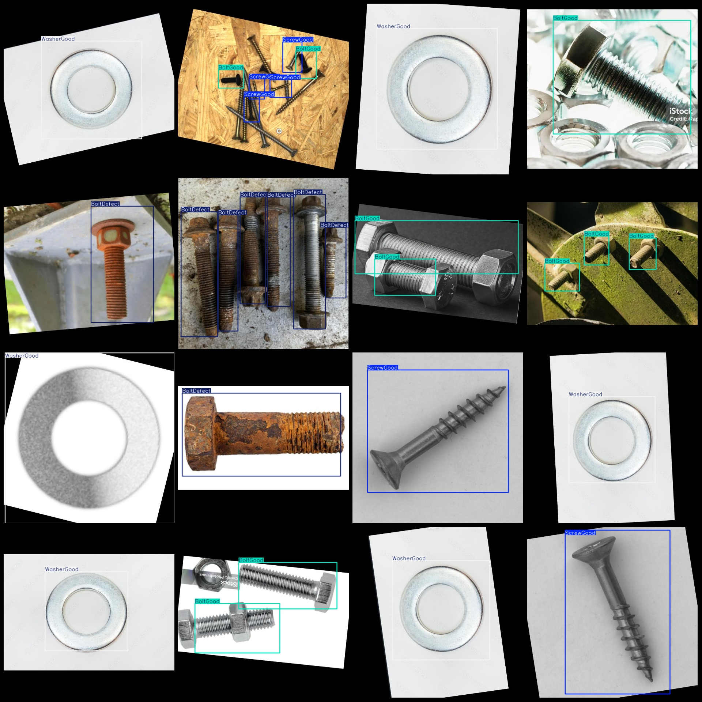

# Screw, Bolt and Washer Defect Detection with Rust and Scratch Data Set in VOC+YOLO format with 1291 images in 6 categories with enhanced

Note: In the dataset, 1/3 of the images are enhanced rotations of the original image.
Dataset format: Pascal VOC format + YOLO format (excluding split path's txtfile, only containing jpgimage and corresponding VOC format xmlfile and yolo format txtfile)
number of images: 1291  
annotation count: 1291  
annotation count: 1291  
annotationnumber of classes: 6  
annotation class names:["BoltDefect", "BoltGood", "ScrewDefect", "ScrewGood", "WasherDefect", "WasherGood"]
Number of bounding boxes per category
BoltDefect box count = 463
BoltGood box count = 832
ScrewDefect box count = 92
ScrewGood box count = 626
WasherDefect box count = 143
WasherGood box count = 367
total boxes: 2523  
images per class:   
Bolted Defective (Bolt Defect) Images = 249
BoltGood (bolt good) is a brand name for a type of fastener. The number 361 refers to the number of images associated with BoltGood, which is 361.
ScrewDefect images = 86
ScrewGood images = 324
The WasherDefect ("Washer Defect") has a possession count of 74.
"WasherGood" stands for "washer good", which refers to the condition of a washer. The phrase "298" indicates the number of images associated with this term, which is 298.
image resolution: 640x640  
Use the annotation tool: labelImg.
Markdown is a lightweight markup language that allows people to write documents, web pages, and other things in plain text.

```markdown

# Title
## Subtitle
### Subsubtitle
#### Subsubsubtitle

```
Important Note: The dataset is not divided into training, validation, and test sets; you need to divide it yourself.
Special statement: This dataset does not guarantee the accuracy of the trained model or weight file.
Image preview:
## Images






Here is a pay link on Stripe ( https://buy.stripe.com/3cs8yP7sY87d0vu9AB ). Please contact me lonlonago@foxmail.com after funding $89, and I will send you a complete data files , thank you!

